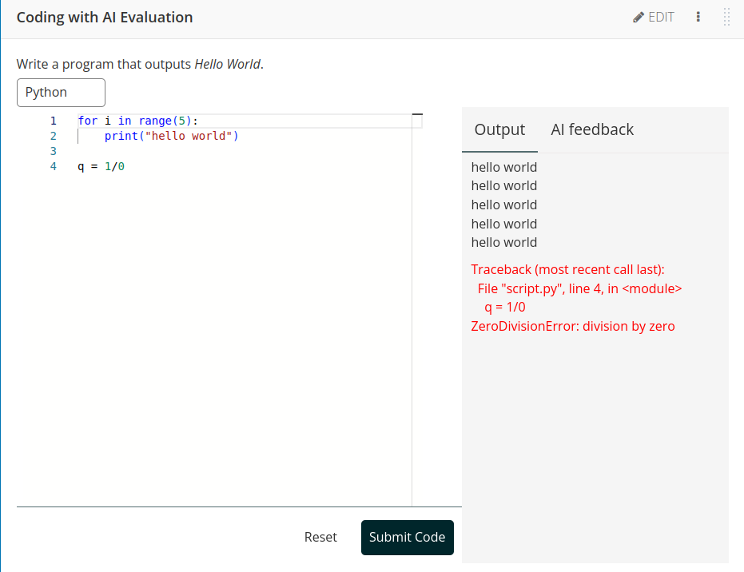

## Introduction

This repository hosts several Open edX XBlocks, including:

1. **Short Answer with AI Evaluation**: This XBlock allows students to submit short answers, which are then evaluated with the help of a large language model (LLM).
2. **Coding with AI Evaluation**: This XBlock allows students to submit code in a text editor. The code is executed via a third-party API (currently using [Judge0](https://judge0.com/)), and both the code and its output are sent to an LLM for feedback.
3. **AI Eval Export (staff tool)**: This XBlock allows course staff to export learner conversations/sessions from supported AI Eval XBlocks as a CSV.

## Screeshots

|  |  |
|-----------------------------------------------------------------------|----------------------------------------------------------------|
|  |  |


## Setup

### Using Tutor

1. Add the following line to the `OPENEDX_EXTRA_PIP_REQUIREMENTS` in your Tutor `config.yml` file:
   ```yaml
   OPENEDX_EXTRA_PIP_REQUIREMENTS:
     - git+https://github.com/open-craft/xblock-ai-evaluation
   ```
   You can append  `@vX.Y.Z` to the URL to specify your desired version.

2. Launch Tutor.

3. In the Open edX platform, navigate to `Settings > Advanced Settings` and add `shortanswer_ai_eval` and `coding_ai_eval` to the `Advanced Module List`. If you want the export tool, also add `ai_eval_export`.

4. Add either XBlock using the `Advanced` button in the `Add New Component` section of Studio.

5. Configure the added Xblock and make sure to add correct API keys. You can format your question and prompts using [Markdown](https://marked.js.org/demo/).

### Export Tool (ai_eval_export)

The `ai_eval_export` XBlock is a preconfigured, staff-only tool for exporting learner conversation/session history from supported AI Eval XBlocks in a course.

- Enable it by adding `ai_eval_export` to the course `Advanced Module List`, then add it to a unit via the Studio “Advanced” component picker.
- It only works from the LMS (Studio/CMS uses different Celery queues), and it only renders for course staff.
- Clicking “Start export” generates a CSV and provides a download link when ready.
- The CSV includes a `Course Name` column (human-readable course title) and includes `Location` to identify the specific XBlock usage within the course.

### PDF transcript downloads

#### Configuration

Admins can optionally provide settings. Settings available:

- `PDF_HEADER_LOGO`: a url to a logo image to use in the header of the PDF transcripts. Defaults to `settings.FOOTER_OPENEDX_LOGO_IMAGE` if available.

Configure this in Django SiteConfiguration site values under the key `ai_eval`. For example:

```json
{
  "ai_eval": {
    "PDF_HEADER_LOGO": "https://picsum.photos/300/70"
  }
}
```

#### Fonts

For emoji support in PDFs, the LMS and CMS backend needs a system font that supports emoji. We suggest `fonts-noto-color-emoji`.

Also, the PDFs are designed to use the "Inter" font. If this font is not available, it will fall back to similar available fonts. However, for the full experience, `fonts-inter` can be installed on the LMS and CMS machines.

An example Tutor plugin to make the above fonts available:

```python
from tutor import hooks

hooks.Filters.ENV_PATCHES.add_item(
    (
        "openedx-dockerfile-minimal",
"""
RUN --mount=type=cache,target=/var/cache/apt,sharing=locked \
    --mount=type=cache,target=/var/lib/apt,sharing=locked \
    apt update && apt install -y fonts-inter fonts-noto-color-emoji
"""
    )
)
```

### API Configuration

The XBlocks support multiple ways to configure API keys and URLs for language models.
The system will check for these configurations in the following order:
1. **XBlock-level configuration**: API keys and URLs can be set directly in each XBlock instance through the Studio UI.
2. **Site configuration**: Values can be set globally for all XBlocks using Open edX's Site Configuration.
   To configure values in Site Configuration, navigate to `Django admin > Site Configurations` and add the following keys:
   ```json
    {
        "ai_eval": {
             "GPT4O_API_KEY": "your-openai-api-key",
             "CLAUDE_SONNET_API_KEY": "your-anthropic-api-key",
             "LLAMA_API_URL": "https://your-llama-endpoint"
        }
    }
    ```
3. **Django settings**: Values can be defined in the Django settings.
   To configure in Django settings (e.g., in Tutor), add the following to your configuration:
   ```python
   XBLOCK_SETTINGS = {
       "ai_eval": {
           "GPT4O_API_KEY": "your-openai-api-key",
           "CLAUDE_SONNET_API_KEY": "your-anthropic-api-key",
           "LLAMA_API_URL": "https://your-llama-endpoint"
        }
    }
    ```

#### Note About API URLs

API URLs are only required and used with the LLAMA model (`ollama/llama2`). Other models use their standard endpoints and only require API keys.

#### Security Considerations

For better security, we recommend using site configuration or Django settings instead of configuring API keys at the
XBlock level. This prevents API keys from being exposed in course exports.

Studio behavior:
- `Chosen model API Key` is disabled in Studio when either:
  - a model API key is already available via Site Configuration or Django `XBLOCK_SETTINGS`, or
  - `USE_CUSTOM_LLM_SERVICE` is enabled.
  This lock is model-specific: changing the selected model can enable/disable the field based on that model's configured key.

### Short Answer character limit

The Short Answer block limits learner input to 1000 characters by default. Operators can change
this with the `SHORTANSWER_CHARACTER_LIMIT` key in the same `ai_eval` namespace, via Site
Configuration or Django `XBLOCK_SETTINGS` (Site Configuration takes precedence):

```python
XBLOCK_SETTINGS = {
    "ai_eval": {
        "SHORTANSWER_CHARACTER_LIMIT": 2000,
    }
}
```

Caution: the whole conversation is re-sent to the model on every exchange, so a higher limit increases
per-request token usage (and cost) as well as the size of the stored conversation history.
Invalid or non-positive values are ignored with a logged warning, and the default of 1000 is used.

### Choosing which AI models are available

When authoring an AI Eval XBlock, the author selects an AI model from a dropdown of built-in models.
An administrator can change which model is offered, and keep activities working when a provider retires a model,
using **Site Configuration** (`Django admin > SiteConfigurations`) under the `ai_eval` namespace.

#### Override the model offered for a slot

Set `<SLOT>_MODEL` to the model id you want the dropdown to offer for that slot. The available
slots and their default models are:

| Site Configuration key | Default model        |
| ---------------------- | -------------------- |
| `GPT4O_MODEL`          | `gpt-4o`             |
| `GPT4O_MINI_MODEL`     | `gpt-4o-mini`        |
| `GEMINI_PRO_MODEL`     | `gemini/gemini-pro`  |
| `CLAUDE_SONNET_MODEL`  | `claude-sonnet-4-6`  |
| `LLAMA_MODEL`          | `ollama/llama2`      |

Only add the slots you want to change; the others keep their defaults. For example, to offer a
newer Claude model:

```json
{
  "ai_eval": {
    "CLAUDE_SONNET_MODEL": "claude-sonnet-4-7"
  }
}
```

Authors editing an activity will then see `claude-sonnet-4-7` in the model dropdown.

#### Configure replacements for deprecated models

When a provider retires a model, activities already configured with that model id would stop
working. To redirect them to a replacement without editing each course, set `DEPRECATED_MODELS`
to a mapping of `retired model id` → `replacement model id`. It is applied automatically at
runtime, so existing activities keep working:

```json
{
  "ai_eval": {
    "DEPRECATED_MODELS": {
      "claude-sonnet-4-20250514": "claude-sonnet-4-6"
    }
  }
}
```

Usually you set both together — point the slot at the new model and redirect the old id to it:

```json
{
  "ai_eval": {
    "CLAUDE_SONNET_MODEL": "claude-sonnet-4-7",
    "DEPRECATED_MODELS": { "claude-sonnet-4-6": "claude-sonnet-4-7" }
  }
}
```

### Custom LLM Service (advanced)

The XBlocks can optionally route all LLM interactions through a custom LLM service instead of the default provider.
To enable a custom service, configure the following **Site Configuration** keys under the `ai_eval` namespace:

```json
{
  "ai_eval": {
    "USE_CUSTOM_LLM_SERVICE": true,
    "CUSTOM_LLM_MODELS_URL": "https://your-custom-service/models",
    "CUSTOM_LLM_COMPLETIONS_URL": "https://your-custom-service/completions",
    "CUSTOM_LLM_TOKEN_URL": "https://your-custom-service/oauth/token"
  }
}
```

Additionally, set your client credentials in Django settings (e.g. via Tutor config):

```python
CUSTOM_LLM_CLIENT_ID = "your-client-id"
CUSTOM_LLM_CLIENT_SECRET = "your-client-secret"
```

Your custom service must implement the expected OAuth2 client‑credentials flow and provide JSON endpoints
for listing models, obtaining completions, and fetching tokens as used by `CustomLLMService`.

#### Optional provider threads (conversation IDs)

For deployments using a custom LLM service, you can enable provider‑side threads to cache context between turns. This is optional and disabled by default. When enabled, the LMS/XBlock remains the canonical chat history as that ensures vendor flexibility and continuity; provider threads are treated as a cache.

- Site configuration (under `ai_eval`):
  - `PROVIDER_SUPPORTS_THREADS`: boolean, default `false`. When `true`, `CustomLLMService` attempts to reuse a provider conversation ID.
- XBlock user state (managed automatically):
  - `thread_map`: a dictionary mapping `tag -> conversation_id`, where `tag = provider:model:prompt_hash`. This allows multiple concurrent provider threads per learner per XBlock, one per distinct prompt/model context.

Reset clears `thread_map`. If a provider ignores threads, behavior remains stateless.

Compatibility and fallback
- Not all vendors/models support `conversation_id`. The default service path (via LiteLLM chat completions) does not use provider threads; calls remain stateless.
- If threads are unsupported or ignored by a provider, the code still works and behaves statelessly.
- With a custom provider that supports threads, the first turn sends full context and later turns send only the latest user input along with the cached `conversation_id`.

### Custom Code Execution Service (advanced)

The Coding XBlock can route code execution to a third‑party service instead of Judge0. The service is expected to be asynchronous, exposing a submit endpoint that returns a submission identifier, and a results endpoint that returns the execution result when available. Configure this via Django settings:

```python
# e.g., in Tutor's extra settings
AI_EVAL_CODE_EXECUTION_BACKEND = {
    'backend': 'custom',
    'custom_config': {
        'submit_endpoint': 'https://code-exec.example.com/api/submit',
        'results_endpoint': 'https://code-exec.example.com/api/results/{submission_id}',
        'languages_endpoint': 'https://code-exec.example.com/api/languages',
        'api_key': 'example-key',
        # For Bearer tokens (default): Authorization: Bearer <token>
        'auth_header_name': 'Authorization',
        'auth_scheme': 'Bearer',
        # Networking
        'timeout': 30,
    },
}
```

Header examples
- Bearer (default): `Authorization: Bearer <API_KEY>` (use `auth_header_name='Authorization'`, `auth_scheme='Bearer'`)
- Vendor header without scheme: `X-API-Key: <API_KEY>` (use `auth_header_name='X-API-Key'`, `auth_scheme=''`)

Notes
- Asynchronous model: `submit_endpoint` should return an identifier (e.g., `submission_id` or `id`) that is later used to poll `results_endpoint`.
- `results_endpoint` must include `{submission_id}` and return execution status and outputs when ready.
- `languages_endpoint` is called during initialization to verify supported languages.
- To use self-hosted Judge0, set `backend='judge0'`.
  - If `AI_EVAL_CODE_EXECUTION_BACKEND` is defined, provide `judge0_config.api_key` in Django settings.
  - If `AI_EVAL_CODE_EXECUTION_BACKEND` is not defined, the per-XBlock `Judge0 API Key` field is used.
  - Optionally set `judge0_config.base_url`; otherwise the default RapidAPI endpoint is used.
- Studio disables the per-XBlock `Judge0 API Key` field when
  `AI_EVAL_CODE_EXECUTION_BACKEND.backend='judge0'` and
  `judge0_config.api_key` is provided in runtime settings.

Example Judge0 configuration
```python
# Self-hosted Judge0 API key and base URL come from Django settings
AI_EVAL_CODE_EXECUTION_BACKEND = {
    'backend': 'judge0',
    'judge0_config': {
        'api_key': 'your-judge0-api-key',
        'base_url': 'https://judge0-ce.p.rapidapi.com',
    },
}
```

## Dependencies
- [Judge0 API](https://judge0.com/)
- [Monaco editor](https://github.com/microsoft/monaco-editor)
- [LiteLLM](https://github.com/BerriAI/litellm)
